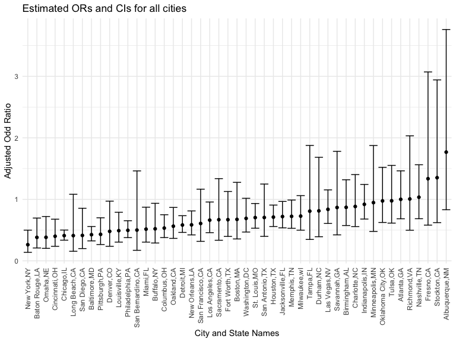
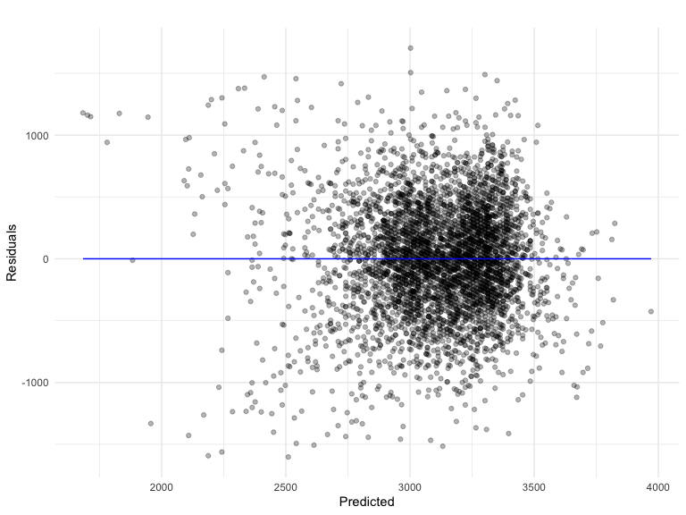

p8105_nr2774
================

### Problem 1

### Problem 2

Create a city_state variable (e.g. “Baltimore, MD”), and a binary
variable indicating whether the homicide is solved. Omit cities Dallas,
TX; Phoenix, AZ; and Kansas City, MO – these don’t report victim race.
Also omit Tulsa, AL – this is a data entry mistake. For this problem,
limit your analysis those for whom victim_race is white or black. Be
sure that victim_age is numeric.

For the city of Baltimore, MD, use the glm function to fit a logistic
regression with resolved vs unresolved as the outcome and victim age,
sex and race as predictors. Save the output of glm as an R object; apply
the broom::tidy to this object;

# and obtain the estimate and confidence interval of the adjusted odds ratio for solving homicides comparing male victims to female victims keeping all other variables fixed.

# Now run glm for each of the cities in your dataset, and extract the adjusted odds ratio (and CI) for solving homicides comparing male victims to female victims.

# Do this within a “tidy” pipeline, making use of purrr::map, list columns, and unnest as necessary to create a dataframe with estimated ORs and CIs for each city.

# Create a plot that shows the estimated ORs and CIs for each city. Organize cities according to estimated OR, and comment on the plot.

``` r
# why do we have to apply group by?
# tidying dataset 
df = read_csv(file = "data/homicide-data.csv") |> 
    janitor::clean_names() |>
    mutate(city_state = str_c(city, state, sep = ","),
           homicide_binary = ifelse(disposition == "Closed by arrest",1,0),
           victim_age = as.numeric(victim_age),
           victim_race =as.factor(victim_race)) |> 
    group_by(city_state) |> 
    filter(city_state != "Dallas,TX" & city_state != "Tulsa,AL" & city_state != "Phoenix,AZ" & city_state != "Kansas City,MO") |>
    filter(victim_race == "White" | victim_race == "Black") |> 
    filter(!is.na(victim_age))
```

    ## Rows: 52179 Columns: 12
    ## ── Column specification ────────────────────────────────────────────────────────
    ## Delimiter: ","
    ## chr (9): uid, victim_last, victim_first, victim_race, victim_age, victim_sex...
    ## dbl (3): reported_date, lat, lon
    ## 
    ## ℹ Use `spec()` to retrieve the full column specification for this data.
    ## ℹ Specify the column types or set `show_col_types = FALSE` to quiet this message.

``` r
baltimore_df = df |> 
    filter(city_state == "Baltimore,MD") 

baltimore_glm = 
    glm(data = baltimore_df, homicide_binary ~ victim_age + victim_sex + victim_race, family = binomial()) |> broom::tidy() |> 
    mutate(
    OR = exp(estimate),
    lower_ci = exp(estimate - 1.96 * std.error),
    upper_ci = exp(estimate + 1.96 * std.error)
  ) |> 
  select(term, estimate, OR, lower_ci,upper_ci ) |>
    filter(term == "victim_sexMale") |> 
    knitr::kable(digits = 3)
baltimore_glm
```

| term           | estimate |    OR | lower_ci | upper_ci |
|:---------------|---------:|------:|---------:|---------:|
| victim_sexMale |   -0.854 | 0.426 |    0.325 |    0.558 |

``` r
all_state_function = function(df) {
    glm(data = df, homicide_binary ~ victim_age + victim_sex + victim_race, family = binomial()) |> broom::tidy() |> 
    mutate(
    OR = exp(estimate),
    lower_ci = exp(estimate - 1.96 * std.error),
    upper_ci = exp(estimate + 1.96 * std.error)
  ) |> 
  select(term, estimate, OR, lower_ci,upper_ci ) |>
    filter(term == "victim_sexMale") 
}
    

all_state_glm = df |>
    nest(mini_data = c(-13)) |> 
    mutate(
    state_glm = map(.x = mini_data, all_state_function)) %>%
    select(-mini_data) |> 
    unnest(state_glm)
```

``` r
all_state_glm %>% 
  ggplot(aes(x = fct_reorder(city_state, OR), y = OR)) +
  geom_point() + 
  geom_errorbar(aes(ymin = lower_ci, ymax = upper_ci)) + 
  theme(axis.text.x = element_text(angle = 90, vjust = 0.5, hjust = 1))+
  labs(
    x = "City and State Names",
    y = "Adjusted Odd Ratio",
    title = "Estimated ORs and CIs for all cities"
  )
```



### Problem 3

In this problem, you will analyze data gathered to understand the
effects of several variables on a child’s birthweight. This dataset,
available here, consists of roughly 4000 children and includes the
following variables:

Load and clean the data for regression analysis (i.e. convert numeric to
factor where appropriate, check for missing data, etc.).

Propose a regression model for birthweight. This model may be based on a
hypothesized structure for the factors that underly birthweight, on a
data-driven model-building process, or a combination of the two.
Describe your modeling process and show a plot of model residuals
against fitted values – use add_predictions and add_residuals in making
this plot.

Compare your model to two others:

One using length at birth and gestational age as predictors (main
effects only) One using head circumference, length, sex, and all
interactions (including the three-way interaction) between these Make
this comparison in terms of the cross-validated prediction error; use
crossv_mc and functions in purrr as appropriate.

Note that although we expect your model to be reasonable, model building
itself is not a main idea of the course and we don’t necessarily expect
your model to be “optimal”.

``` r
birthweight_df = 
  read_csv("data/birthweight.csv") |> 
    janitor::clean_names() %>%
  mutate(
    babysex = case_when(
      babysex == 1 ~ "Male",
      babysex == 2 ~ "Female"
    )) %>% mutate(
          menarche = as.factor(menarche),
parity = as.factor(parity),
frace = as.factor(frace),
mrace = as.factor(mrace),
malform = as.factor(malform),
babysex = as.factor(babysex))
```

    ## Rows: 4342 Columns: 20
    ## ── Column specification ────────────────────────────────────────────────────────
    ## Delimiter: ","
    ## dbl (20): babysex, bhead, blength, bwt, delwt, fincome, frace, gaweeks, malf...
    ## 
    ## ℹ Use `spec()` to retrieve the full column specification for this data.
    ## ℹ Specify the column types or set `show_col_types = FALSE` to quiet this message.

``` r
sapply(birthweight_df, function(x) sum(is.na(x)))         
```

    ##  babysex    bhead  blength      bwt    delwt  fincome    frace  gaweeks 
    ##        0        0        0        0        0        0        0        0 
    ##  malform menarche  mheight   momage    mrace   parity  pnumlbw  pnumsga 
    ##        0        0        0        0        0        0        0        0 
    ##    ppbmi     ppwt   smoken   wtgain 
    ##        0        0        0        0

There are no missing values found in the output. For the better
understanding and readability babies sex are modified as Male and
Female. There are 4342 of rows and 20 of colums in the birthweight data
frame. Variables were chosen based on the 10 factors that affect a
baby’s birth weight articles on the internet.

``` r
model_birthweight_1 = 
    lm(data = birthweight_df , bwt ~ parity + frace + malform + malform + babysex + gaweeks)

model_birthweight_1|> broom::tidy()
```

    ## # A tibble: 11 × 5
    ##    term        estimate std.error statistic   p.value
    ##    <chr>          <dbl>     <dbl>     <dbl>     <dbl>
    ##  1 (Intercept)    785.      89.7      8.76  2.83e- 18
    ##  2 parity1        122.     451.       0.270 7.87e-  1
    ##  3 parity3        418.     451.       0.929 3.53e-  1
    ##  4 parity6        755.     452.       1.67  9.54e-  2
    ##  5 frace2        -239.      14.5    -16.5   2.04e- 59
    ##  6 frace3        -103.      67.1     -1.53  1.26e-  1
    ##  7 frace4        -142.      30.3     -4.69  2.78e-  6
    ##  8 frace8         -86.3    121.      -0.715 4.75e-  1
    ##  9 malform1       -36.6    117.      -0.314 7.54e-  1
    ## 10 babysexMale     91.5     13.7      6.68  2.66e- 11
    ## 11 gaweeks         60.8      2.22    27.4   7.56e-153

``` r
library(modelr)
birthweight_df %>% 
  add_residuals(model_birthweight_1)|> 
  add_predictions(model_birthweight_1) |>  
  ggplot(aes(x = pred, y = resid)) + 
  geom_point(alpha = 0.3) +
  labs(
    title = "",
    x = "Predicted",
    y = "Residuals"
    ) +
  theme(plot.title = element_text(hjust = 0.5))+
  geom_line(aes(y = 0), color = "blue")
```



The residuals “bounce randomly” around the 0 line. This suggests that
the assumption that the relationship is linear is reasonable. The
residuals roughly form a “horizontal band” around the 0 line. This
suggests that the variances of the error terms are equal. No one
residual “stands out” from the basic random pattern of residuals. This
suggests that there are no outliers.
