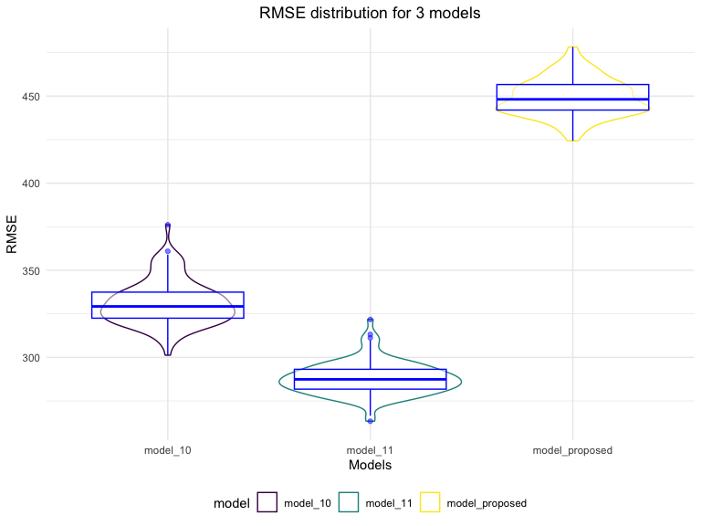

p8105_nr2774
================

### Problem 1

To obtain a distribution for $\hat{r}^2$, we’ll follow basically the
same procedure we used for regression coefficients: draw bootstrap
samples; the a model to each; extract the value I’m concerned with; and
summarize. Here, we’ll use `modelr::bootstrap` to draw the samples and
`broom::glance` to produce `r.squared` values.

``` r
weather_df = 
  rnoaa::meteo_pull_monitors(
    c("USW00094728"),
    var = c("PRCP", "TMIN", "TMAX"), 
    date_min = "2017-01-01",
    date_max = "2017-12-31") %>%
  mutate(
    name = recode(id, USW00094728 = "CentralPark_NY"),
    tmin = tmin / 10,
    tmax = tmax / 10) %>%
  select(name, id, everything())
```

    ## Registered S3 method overwritten by 'hoardr':
    ##   method           from
    ##   print.cache_info httr

    ## using cached file: ~/Library/Caches/R/noaa_ghcnd/USW00094728.dly

    ## date created (size, mb): 2022-10-08 20:19:28 (8.411)

    ## file min/max dates: 1869-01-01 / 2022-10-31

``` r
weather_df %>% 
  modelr::bootstrap(n = 1000) %>% 
  mutate(
    models = map(strap, ~lm(tmax ~ tmin, data = .x) ),
    results = map(models, broom::glance)) %>% 
  select(-strap, -models) %>% 
  unnest(results) %>% 
  ggplot(aes(x = r.squared)) + geom_density()
```


In this example, the $\hat{r}^2$ value is high, and the upper bound at 1
may be a cause for the generally skewed shape of the distribution. If we
wanted to construct a confidence interval for $R^2$, we could take the
2.5% and 97.5% quantiles of the estimates across bootstrap samples.
However, because the shape isn’t symmetric, using the mean +/- 1.96
times the standard error probably wouldn’t work well.

We can produce a distribution for $\log(\beta_0 * \beta1)$ using a
similar approach, with a bit more wrangling before we make our plot.

``` r
weather_df %>% 
  modelr::bootstrap(n = 1000) %>% 
  mutate(
    models = map(strap, ~lm(tmax ~ tmin, data = .x) ),
    results = map(models, broom::tidy)) %>% 
  select(-strap, -models) %>% 
  unnest(results) %>% 
  select(id = `.id`, term, estimate) %>% 
  pivot_wider(
    names_from = term, 
    values_from = estimate) %>% 
  rename(beta0 = `(Intercept)`, beta1 = tmin) %>% 
  mutate(log_b0b1 = log(beta0 * beta1)) %>% 
  ggplot(aes(x = log_b0b1)) + geom_density()
```


As with $r^2$, this distribution is somewhat skewed and has some
outliers.

The point of this is not to say you should always use the bootstrap –
it’s possible to establish “large sample” distributions for strange
parameters / values / summaries in a lot of cases, and those are great
to have. But it is helpful to know that there’s a way to do inference
even in tough cases.

### Problem 2

``` r
# tidying dataset 

df = read_csv(file = "data/homicide-data.csv") |> 
    janitor::clean_names() |>
    mutate(city_state = str_c(city, state, sep = ","),
           homicide_binary = ifelse(disposition == "Closed by arrest",1,0),
           victim_age = as.numeric(victim_age),
           victim_race =as.factor(victim_race)) |> 
    group_by(city_state) |> 
    filter(city_state != "Dallas,TX" & city_state != "Tulsa,AL" & city_state != "Phoenix,AZ" & city_state != "Kansas City,MO") |>
    filter(victim_race == "White" | victim_race == "Black") |> 
    filter(!is.na(victim_age))
```

    ## Rows: 52179 Columns: 12
    ## ── Column specification ────────────────────────────────────────────────────────
    ## Delimiter: ","
    ## chr (9): uid, victim_last, victim_first, victim_race, victim_age, victim_sex...
    ## dbl (3): reported_date, lat, lon
    ## 
    ## ℹ Use `spec()` to retrieve the full column specification for this data.
    ## ℹ Specify the column types or set `show_col_types = FALSE` to quiet this message.

``` r
baltimore_df = df |> 
    filter(city_state == "Baltimore,MD") 

baltimore_glm = 
    glm(data = baltimore_df, homicide_binary ~ victim_age + victim_sex + victim_race, family = binomial()) |> broom::tidy() |> 
    mutate(
    OR = exp(estimate),
    lower_ci = exp(estimate - 1.96 * std.error),
    upper_ci = exp(estimate + 1.96 * std.error)
  ) |> 
  select(term, estimate, OR, lower_ci,upper_ci ) |>
    filter(term == "victim_sexMale") |> 
    knitr::kable(digits = 3)
baltimore_glm
```

| term           | estimate |    OR | lower_ci | upper_ci |
|:---------------|---------:|------:|---------:|---------:|
| victim_sexMale |   -0.854 | 0.426 |    0.325 |    0.558 |

``` r
all_state_function = function(df) {
    glm(data = df, homicide_binary ~ victim_age + victim_sex + victim_race, family = binomial()) |> broom::tidy() |> 
    mutate(
    OR = exp(estimate),
    lower_ci = exp(estimate - 1.96 * std.error),
    upper_ci = exp(estimate + 1.96 * std.error)
  ) |> 
  select(term, estimate, OR, lower_ci,upper_ci ) |>
    filter(term == "victim_sexMale") 
}
    

all_state_glm = df |>
    nest(mini_data = c(-13)) |> 
    mutate(
    state_glm = map(.x = mini_data, all_state_function)) %>%
    select(-mini_data) |> 
    unnest(state_glm)
```

``` r
all_state_glm %>% 
  ggplot(aes(x = fct_reorder(city_state, OR), y = OR)) +
  geom_point() + 
  geom_errorbar(aes(ymin = lower_ci, ymax = upper_ci)) + 
  theme(axis.text.x = element_text(angle = 90, vjust = 0.5, hjust = 1))+
  labs(
    x = "City and State Names",
    y = "Adjusted Odd Ratio",
    title = "Estimated ORs and CIs for all cities"
  )
```


### Problem 3

In this problem, you will analyze data gathered to understand the
effects of several variables on a child’s birthweight. This dataset,
available here, consists of roughly 4000 children and includes the
following variables:

Load and clean the data for regression analysis (i.e. convert numeric to
factor where appropriate, check for missing data, etc.).

Propose a regression model for birthweight. This model may be based on a
hypothesized structure for the factors that underly birthweight, on a
data-driven model-building process, or a combination of the two.
Describe your modeling process and show a plot of model residuals
against fitted values – use add_predictions and add_residuals in making
this plot.

Compare your model to two others:

One using length at birth and gestational age as predictors (main
effects only) One using head circumference, length, sex, and all
interactions (including the three-way interaction) between these Make
this comparison in terms of the cross-validated prediction error; use
crossv_mc and functions in purrr as appropriate.

Note that although we expect your model to be reasonable, model building
itself is not a main idea of the course and we don’t necessarily expect
your model to be “optimal”.

``` r
birthweight_df = 
  read_csv("data/birthweight.csv") |> 
    janitor::clean_names() %>%
  mutate(
    babysex = case_when(
      babysex == 1 ~ "Male",
      babysex == 2 ~ "Female"
    )) %>% mutate(
          menarche = as.factor(menarche),
parity = as.factor(parity),
frace = as.factor(frace),
mrace = as.factor(mrace),
malform = as.factor(malform),
babysex = as.factor(babysex))
```

    ## Rows: 4342 Columns: 20
    ## ── Column specification ────────────────────────────────────────────────────────
    ## Delimiter: ","
    ## dbl (20): babysex, bhead, blength, bwt, delwt, fincome, frace, gaweeks, malf...
    ## 
    ## ℹ Use `spec()` to retrieve the full column specification for this data.
    ## ℹ Specify the column types or set `show_col_types = FALSE` to quiet this message.

``` r
sapply(birthweight_df, function(x) sum(is.na(x)))         
```

    ##  babysex    bhead  blength      bwt    delwt  fincome    frace  gaweeks 
    ##        0        0        0        0        0        0        0        0 
    ##  malform menarche  mheight   momage    mrace   parity  pnumlbw  pnumsga 
    ##        0        0        0        0        0        0        0        0 
    ##    ppbmi     ppwt   smoken   wtgain 
    ##        0        0        0        0

There are no missing values found in the output. For the better
understanding and readability babies sex are modified as Male and
Female. There are 4342 of rows and 20 of colums in the birthweight data
frame. Variables were chosen based on the 10 factors that affect a
baby’s birth weight articles on the internet.

``` r
model_proposed = 
    lm(data = birthweight_df , bwt ~ frace + malform + malform + babysex + gaweeks)

model_proposed|> broom::tidy()
```

    ## # A tibble: 8 × 5
    ##   term        estimate std.error statistic   p.value
    ##   <chr>          <dbl>     <dbl>     <dbl>     <dbl>
    ## 1 (Intercept)    799.      89.3      8.95  5.16e- 19
    ## 2 frace2        -239.      14.5    -16.5   1.63e- 59
    ## 3 frace3        -103.      67.1     -1.54  1.25e-  1
    ## 4 frace4        -143.      30.3     -4.71  2.54e-  6
    ## 5 frace8         -86.5    121.      -0.716 4.74e-  1
    ## 6 malform1       -36.9    117.      -0.317 7.52e-  1
    ## 7 babysexMale     90.9     13.7      6.64  3.63e- 11
    ## 8 gaweeks         60.4      2.21    27.4   1.64e-152

``` r
birthweight_df %>% 
  add_residuals(model_proposed) |> 
  add_predictions(model_proposed) |>  
  ggplot(aes(x = pred, y = resid)) + 
  geom_point(alpha = 0.3) +
  labs(
    title = "",
    x = "Predicted",
    y = "Residuals"
    ) +
  theme(plot.title = element_text(hjust = 0.5))+
  geom_line(aes(y = 0), color = "blue")
```


-   The residuals “bounce randomly” around the 0 line. This suggests
    that the assumption that the relationship is linear is reasonable.

-   The residuals roughly form a “horizontal band” around the 0 line.
    This suggests that the \* variances of the error terms are equal.

-   No one residual “stands out” from the basic random pattern of
    residuals. This suggests that there are no outliers.

-   Constant variance assumption does not work here. It means that when
    I run hypothesis test, i should be aware of non-constant variance.

``` r
# which one is null? both? alternative model is my model? 

model_1 = 
    lm(data = birthweight_df , bwt ~ blength + gaweeks)

model_1|> broom::tidy()
```

    ## # A tibble: 3 × 5
    ##   term        estimate std.error statistic  p.value
    ##   <chr>          <dbl>     <dbl>     <dbl>    <dbl>
    ## 1 (Intercept)  -4348.      98.0      -44.4 0       
    ## 2 blength        129.       1.99      64.6 0       
    ## 3 gaweeks         27.0      1.72      15.7 2.36e-54

``` r
# Interactions
model_2 =
    lm(data = birthweight_df, bwt ~ bhead + blength + 
           babysex + bhead*blength + blength*babysex + 
           bhead*babysex + bhead*blength*babysex)

model_2|> broom::tidy()
```

    ## # A tibble: 8 × 5
    ##   term                      estimate std.error statistic    p.value
    ##   <chr>                        <dbl>     <dbl>     <dbl>      <dbl>
    ## 1 (Intercept)                -802.    1102.       -0.728 0.467     
    ## 2 bhead                       -16.6     34.1      -0.487 0.626     
    ## 3 blength                     -21.6     23.4      -0.926 0.354     
    ## 4 babysexMale               -6375.    1678.       -3.80  0.000147  
    ## 5 bhead:blength                 3.32     0.713     4.67  0.00000317
    ## 6 blength:babysexMale         124.      35.1       3.52  0.000429  
    ## 7 bhead:babysexMale           198.      51.1       3.88  0.000105  
    ## 8 bhead:blength:babysexMale    -3.88     1.06     -3.67  0.000245

``` r
cv_df =
  crossv_mc(birthweight_df, 100) %>% 
    mutate(
    train = map(train, as_tibble),
    test = map(test, as_tibble)) |> 
    mutate(
        model_10 = map(train, ~lm(bwt ~ blength + gaweeks, data = .x)),
        model_11 = map(train, ~lm(bwt ~ bhead + blength + 
           babysex + bhead*blength + blength*babysex + 
           bhead*babysex + bhead*blength*babysex, data = .x)),
    model_proposed = map(train, ~lm(bwt ~frace + malform + malform + babysex + gaweeks, data = .x))) %>% 
    mutate(
    rmse_model_10 = map2_dbl(.x = model_10, test, ~rmse(model = .x, data = .y)),
    rmse_model_11 = map2_dbl(.x = model_11, test, ~rmse(model = .x, data = .y)),
    rmse_model_proposed = map2_dbl(.x = model_proposed, test, ~rmse(model = .x, data = .y)))
```

``` r
cv_df %>% 
  select(starts_with("rmse")) %>% 
  pivot_longer(
    everything(),
    names_to = "model", 
    values_to = "rmse",
    names_prefix = "rmse_") %>% 
  mutate(model = fct_inorder(model)) %>% 
  ggplot(aes(x = model, y = rmse, color = model)) + geom_violin() + 
    geom_boxplot(alpha = 0.5, color = "blue")+
  labs(
    x = "Models",
    y = "RMSE",
    title = " RMSE distribution for 3 models "
  )+
  theme( plot.title = element_text(hjust = .5))
```


